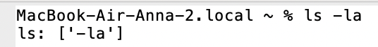
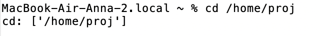
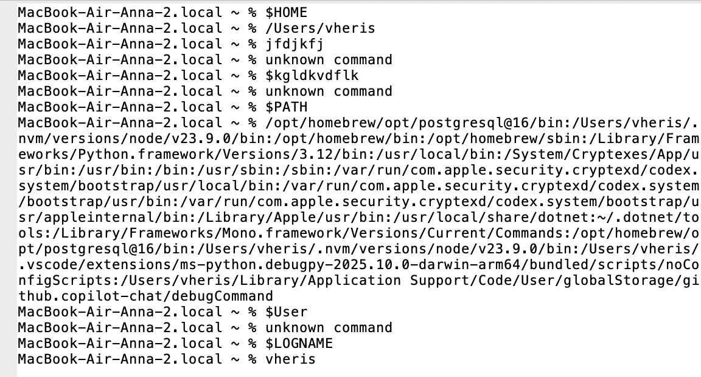

# О программе

**VFS Эмулятор** - это графическое приложение, имитирующее работу командной строки UNIX-подобной операционной системы. Эмулятор предоставляет базовый функционал для выполнения команд, работы с переменными окружения и отображения истории ввода.

## Функционал программы

**1. ls [аргументы] - заглушка команды ls**  
Результат работы команды:


**2. cd [аргументы] - заглушка команды cd**  
Результат работы команды:


**3. $(Имя переменной окружения) - показывает путь до переменной окружения**  
Результат работы команды:


**4. Команда exit - завершает работу приложения**  

## Как запустить VFS Эмулятор

```
1. git clone https://github.com/vheris/configuration-management-practice-1.git
2. В терминал ввести: python3 main.py / python main.py
```
## Добавлены скрипты реальной ОС, в которой выполняется эмулятор.

**start_vhs.bat/sh** - запускает VFS эмулятор через реальную ОС  
**test_basic.bat/sh** - запускает тест VFS эмулятора через реальную ОС (Базовое тестирование)  
**test_error.bat/sh** - запускает тест VFS эмулятора через реальную ОС (Тестирование обработки ошибок)  

## Примеры использования:


