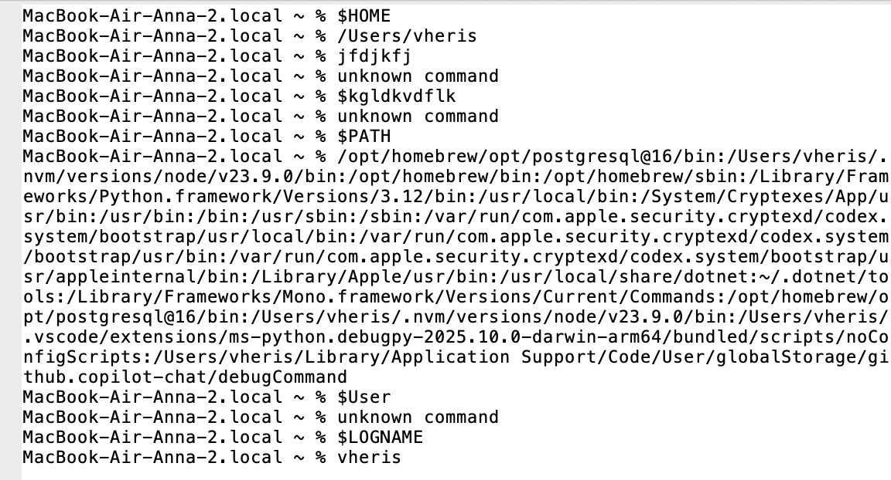

# О программе

**VFS Эмулятор** - это графическое приложение, имитирующее работу командной строки UNIX-подобной операционной системы. Эмулятор предоставляет базовый функционал для выполнения команд, работы с переменными окружения и отображения истории ввода.

## Функционал программы

**1. ls [аргументы] - показывает содержимое указанной директории VFS**

**2. cd [аргументы] - меняет текущую директорию внутри VFS**  

**3. $(Имя переменной окружения) - показывает путь до переменной окружения**  
Результат работы команды:  


**4. Команда exit - завершает работу приложения**

**5. Реализованы эмуляторы файловой системы**

**6. tac [аргументы] - выводит содержимое файла в обратном порядке строк.**

**7. wc [аргументы] - считает строки, слова и символы в файле и выводит статистику.**

**8. uname [аргументы] - возвращает информацию о системе хоста (поддерживаются опции -a, -s, -n, -r, -v, -m).**


## Как запустить VFS Эмулятор

```
1. git clone https://github.com/vheris/configuration-management-practice-1.git
2. В терминал ввести: python3 main.py (путь дл файла с VFS) (путь до файла со скриптом) / python main.py (путь дл файла с VFS) (путь до файла со скриптом)
```
## Добавлены скрипты реальной ОС, в которой выполняется эмулятор.

**start_vhs.bat/sh** - запускает VFS эмулятор   
**test_basic.bat/sh** - запускает тест VFS эмулятора через реальную ОС (Базовое тестирование)  
**test_error.bat/sh** - запускает тест VFS эмулятора через реальную ОС (Тестирование обработки ошибок)  
**test_basic/deep/min.bat** - запускает тест VFS (разные эмуляторы файловой системы)  


## Примеры использования:


