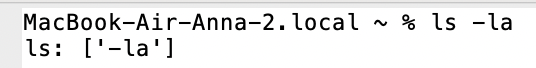
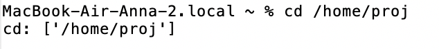

# О программе

** VFS Эмулятор ** - это графическое приложение, имитирующее работу командной строки UNIX-подобной операционной системы. Эмулятор предоставляет базовый функционал для выполнения команд, работы с переменными окружения и отображения истории ввода.

## Функционал программы

** 1. ls [аргументы] - заглушка команды ls **
Результат работы команды:


** 2. cd [аргументы] - заглушка команды cd **
Результат работы команды:


** 3. $(Имя переменной окружения) - показывает путь до переменной окружения **
Результат работы команды:


** 4. Команла exit - завершает работу приложения **

## Как запустить VFS Эмулятор
```
1. git clone https://github.com/vheris/configuration-management-practice-1.git
2. В терминал ввести: python3 main.py / python main.py
```

## Примеры использования:
